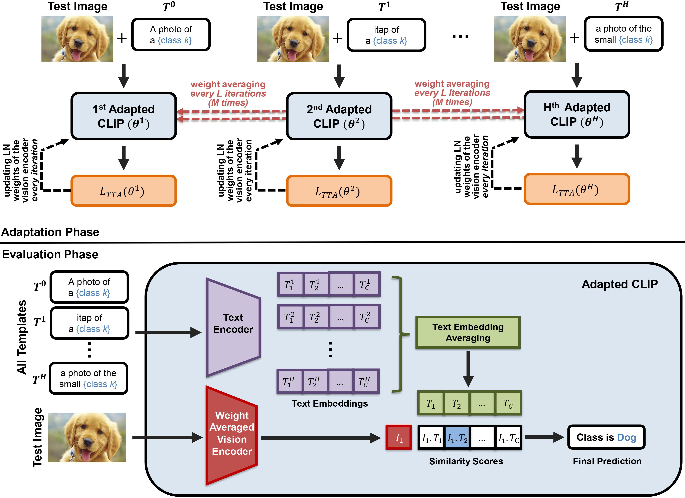

# WATT: Weight Average Test-Time Adaption of CLIP

The official implementation of our paper "WATT: Weight Average Test-Time Adaption of CLIP".


## Mehtod

<p align="center">
    
</p>

<!-- Add space -->
<div style="margin-bottom: 15px;"></div>

* We introduce a novel Test-Time Adaptation method for CLIP that, for the first time, leverages weight averaging across various text templates at test-time.

* Our WATT method represents a pioneering advancement within the TTA paradigm, achieving exceptional performance with the ability to improve using only a single image at test time, a capability not present in previous approaches.

* We rigorously evaluate our WATT methodology through comprehensive evaluations across different datasets characterized by diverse types and degrees of domain shifts, encompassing **a total of 155 evaluation scenarios**. Our experiments demonstrate the robustness and efficacy of WATT compared to existing adaptation methods.


## Requirements 
- [Python 3.9](https://www.python.org/)
- [CUDA 11.7](https://developer.nvidia.com/cuda-zone)
- [PyTorch 2.0.1](https://pytorch.org/)


## Usage
### Step 1: Clone the repository

### Step 2: Setup the Environment
Create an environment and Install the requirements The `environment.yaml` file can be used to install the required dependencies:

```bash
conda env create -f environment.yml
```

### Step 3: Prepare Datasets

Supported datasets are:

- [CIFAR10 & CIFAR100](https://www.cs.toronto.edu/~kriz/cifar.html)
- [CIFAR10-C](https://zenodo.org/records/2535967#.YzHFMXbMJPY)
- [CIFAR10.1](https://github.com/modestyachts/CIFAR-10.1)
- [CIFAR100-C](https://zenodo.org/records/2535967#.YzHFMXbMJPY)
- [VLCS](http://www.eecs.qmul.ac.uk/~dl307/project_iccv2017)
- [PACS](http://www.eecs.qmul.ac.uk/~dl307/project_iccv2017)
- [OfficeHome](http://hemanthdv.org/OfficeHome-Dataset/)

To download all datasets, simply run the following command:
```bash
python download_datasets.py --data_dir /path/to/data/
```

### Step 4: Adaptation

There are different bash files in `./bash` directory which are prepared to reproduce the results of the paper for different datasets and domains.

As an example, here is how to run `WATT-S` method for different corruprions of `CIFAR100-C` dataset using the eight text templates `templates.yaml` used in the paper (the corresponding bash file to reprpduce the resuults in the paper is located at `./bash/watt_s/CIFAR/cifar100c.sh`).

```bash
# dataset configuration
DATASET=cifar100   
DATA_DIR=/path/to/data/CIFAR100/   

# adaptation parameters
BATCH_SIZE=128   
LR=1e-3
BACKBONE=ViT-B/32

# method to use for adaptation
METHOD=WATT

# WATT method configurations (please see the paper)
WATT_TYPE=sequential
WATT_L=2
WATT_M=5

# path to text templates that should be used during adaptation
WATT_TEMPLATE_DIR=./templates.yaml
# List of all corruption types for adaptation
ALL_CORRUPTIONS="gaussian_noise shot_noise" 

# Execute the adaptation process with specified parameters
python main.py --data_dir $DATA_DIR --dataset $DATASET --adapt --method $METHOD --save_dir ./save --backbone $BACKBONE --batch-size $BATCH_SIZE --lr $LR --watt_type $WATT_TYPE --watt_l $WATT_L --watt_m $WATT_M --watt_temps $WATT_TEMPLATE_DIR  --corruptions_list $ALL_CORRUPTIONS

```

## Results

Here are the results of our prposed `WATT-P` and `WATT-S` methods on different corruprions of CIFAR100-C dataset. For a more detailed analysis and a complete table of the results, please refer to our paper.


<div align="center">

| Dataset          |  CLIP  |  TENT  |  TPT  | CLIPArTT | WATT-P | WATT-S |
|------------------|:------:|:------:|:-----:|:--------:|:------:|:------:|
| Gaussian Noise   |  14.80 |  14.38 | 14.03 |  25.32   |  31.28 | <b style="color:blue">32.07</b> |
| Shot noise       |  16.03 |  17.34 | 15.25 |  27.90   |  33.44 | <b style="color:blue">34.36</b> |
| Impulse Noise    |  13.85 |  10.03 | 13.01 |  25.62   |  29.40 | <b style="color:blue">30.33</b> |
| Defocus blur     |  36.74 |  49.05 | 37.60 |  49.88   |  52.32 | <b style="color:blue">52.99</b> |
| Glass blur       |  14.19 |  3.71  | 16.41 |  27.89   |  31.20 | <b style="color:blue">32.15</b> |
| Motion blur      |  36.14 |  46.62 | 37.52 |  47.93   |  49.72 | <b style="color:blue">50.53</b> |
| Zoom blur        |  40.24 |  51.84 | 42.99 |  52.70   |  54.72 | <b style="color:blue">55.30</b> |
| Snow             |  38.95 |  46.71 | 42.35 |  49.72   |  51.79 | <b style="color:blue">52.77</b> |
| Frost            |  40.56 |  44.90 | 43.31 |  49.63   |  53.04 | <b style="color:blue">53.79</b> |
| Fog              |  38.00 |  47.31 | 38.81 |  48.77   |  50.78 | <b style="color:blue">51.49</b> |
| Brightness       |  48.18 |  60.58 | 50.23 |  61.27   |  62.65 | <b style="color:blue">63.57</b> |
| Contrast         |  29.53 |  45.90 | 28.09 |  48.55   |  51.34 | <b style="color:blue">52.76</b> |
| Elastic transform|  26.33 |  33.09 | 28.12 |  37.45   |  39.97 | <b style="color:blue">40.90</b> |
| Pixelate         |  21.98 |  26.47 | 20.43 |  33.88   |  39.59 | <b style="color:blue">40.97</b> |
| JPEG compression |  25.91 |  29.89 | 28.82 |  36.07   |  38.99 | <b style="color:blue">39.59</b> |
| <b**Mean**</b>         | 29.43 | 35.19 | 30.46 | 41.51 | 44.68 | <b style="color:blue">**45.57**</b> |

</div>


## Add Your Method
To add a new adaptation method to the framework, follow these steps:

### Step 1: Define Your Method Class

Create a new file for your method in the `adapt` directory. For example, `adapt/new_method.py`. Your method class should have the following four mandatory methods:

```python
class NewMethod:
    def __init__(self, model, lr, param1='default1', param2=10, device='cpu'):
        """
        Initializes the NewMethod module.
        """
    def reset(self):
        pass
    
    def adapt(self, inputs, classes, templates):
        pass
    
    def evaluate(self, inputs, classes, templates):
        pass
```

### Step 2: Update `__init__.py`

```python
from .new_method import NewMethod  # Add this import

def get_method(args, device):

    elif args.method == 'new_method':  # Add this elif clause
        print(f"Selected method: NewMethod with parameters: model={args.backbone}, lr={args.lr}, param1={args.param1}, param2={args.param2}, device={device}")
        return NewMethod(args.backbone, args.lr, param1=args.param1, param2=args.param2, device=device)
```

### Step 3: Add Method-Specific Arguments

Update `add_method_specific_args` in main.py:

```python
def add_method_specific_args(parser, method):

    elif method == 'new_method':  # Add this elif clause
        parser.add_argument('--param1', type=str, default='default1', help='Description for param1')
        parser.add_argument('--param2', type=int, default=10, help='Description for param2')
    
    return parser
```


## License

This source code is released under the MIT license, which can be found [here](./LICENSE).

This project incorporates components from the following repositories. We extend our gratitude to the authors for open-sourcing their work:
- [Tent](https://github.com/DequanWang/tent) (MIT licensed)
- [CLIP](https://github.com/openai/CLIP/tree/main/clip) (MIT licensed)
- [CLIPArTT](https://github.com/dosowiechi/CLIPArTT)
